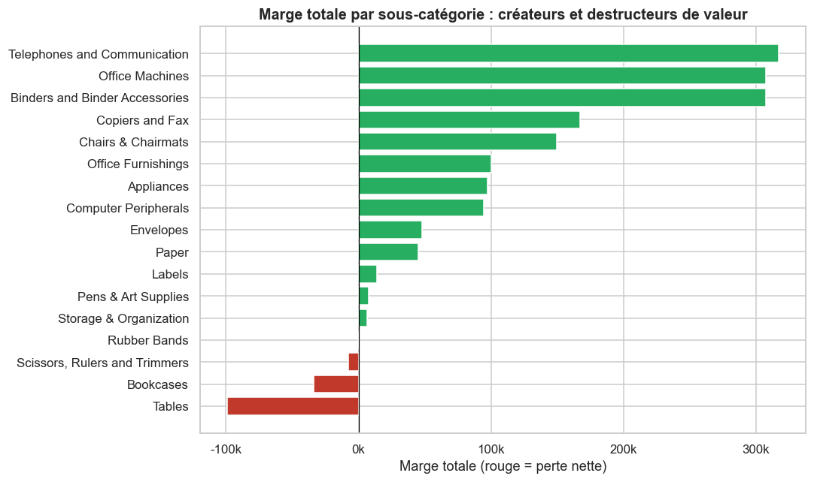
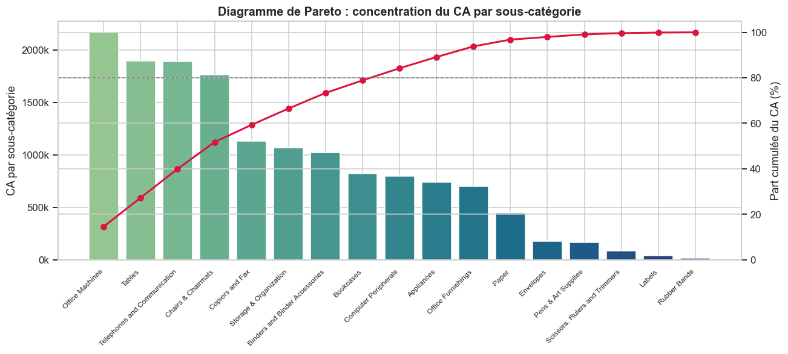
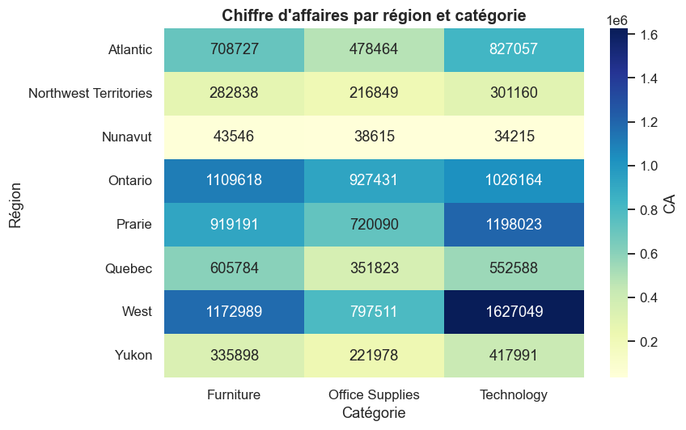

# Analyse de la performance commerciale

> Analyse de 8 399 lignes de commande (jeu de données public *Superstore*) pour comprendre la structure du chiffre d'affaires, distinguer les produits qui créent de la marge de ceux qui en détruisent, et orienter la stratégie commerciale.

  

## 🎯 Objectif

Transformer un export brut de ventes en lecture décisionnelle : d'où vient le CA, quelles catégories sont réellement rentables, et où concentrer les efforts du prochain trimestre.

## 📊 Contexte

Data analyst chez un distributeur de fournitures et de matériel de bureau. La direction dispose de quatre années de ventes (2009-2012) mais d'aucune synthèse. L'enjeu : passer du chiffre d'affaires brut à une analyse de la **rentabilité**.

## 🗂️ Données

- **Source** : jeu de données public *Superstore Sales*, largement utilisé dans la communauté data, téléchargé depuis GitHub par `src/telecharger_donnees.py`.
- **Nature** : il s'agit d'un jeu de données de référence (et non des transactions d'une entreprise nommée), mais réaliste et riche : profit réel par ligne, remises, sous-catégories, plusieurs régions.
- **Volume** : 8 399 lignes de commande, 5 496 commandes distinctes, 2009-2012.

| Colonne (renommée en français) | Description |
|---|---|
| `id_commande`, `date_commande` | Identifiant et date |
| `produit`, `categorie`, `sous_categorie` | Référence et classification |
| `region`, `province` | Localisation |
| `quantite`, `chiffre_affaires`, `marge`, `remise`, `prix_unitaire` | Données économiques de la ligne |
| `segment_client` | Consumer / Corporate / Home Office / Small Business |

## 🛠️ Compétences & outils

Python · pandas (préparation, renommage, groupby, pivot, séries temporelles) · numpy · matplotlib / seaborn · KPI commerciaux · analyse de Pareto · analyse de rentabilité.

## 📈 Résultats clés

| Indicateur | Valeur |
|---|---|
| Chiffre d'affaires total | **14,9 M** |
| Marge (profit) totale | 1,52 M |
| Taux de marge global | **10,2 %** |
| Commandes distinctes | 5 496 |
| Panier moyen par commande | 2 714 |
| Part de lignes vendues à perte | **50,8 %** |

**Quatre enseignements :**

1. **La rentabilité repose sur une minorité de transactions** : plus de la moitié des lignes sont déficitaires, mais l'entreprise reste bénéficiaire grâce à quelques ventes très rentables. Piloter au seul CA serait trompeur.
2. **Technology porte la marge** : à CA comparable, cette catégorie dégage une marge très supérieure à Furniture, dont la marge médiane est négative.
3. **Certaines sous-catégories détruisent de la valeur** : les *Tables* affichent une marge totale de **-99 k**, suivies des *Bookcases*. Candidates à une révision tarifaire ou d'assortiment.
4. **Le segment Corporate est le plus contributeur**, en CA comme en marge.

### Aperçu des visualisations

**Créateurs et destructeurs de valeur (analyse maîtresse)**


**Concentration du CA (Pareto)**


**Répartition géographique**


## ▶️ Comment reproduire

```bash
pip install -r requirements.txt

# 1. Télécharger le dataset (créé data/raw/superstore_sales.csv)
python src/telecharger_donnees.py

# 2a. Lancer l'analyse complète en script
python src/analyse.py

# 2b. ... ou ouvrir le notebook commenté (livrable principal)
jupyter notebook notebooks/analyse.ipynb
```

> Le fichier `data/raw/superstore_sales.csv` est déjà inclus dans le dépôt : l'analyse fonctionne même sans relancer le téléchargement.

## 📁 Structure du projet

```
projet-sales-analytics/
├── README.md
├── requirements.txt
├── data/
│   ├── raw/superstore_sales.csv     # dataset public téléchargé
│   └── processed/                   # données enrichies (marge, taux, perte)
├── notebooks/analyse.ipynb          # analyse commentée (livrable principal)
├── src/
│   ├── telecharger_donnees.py       # télécharge le dataset
│   └── analyse.py                   # version script de l'analyse
└── outputs/
    ├── figures/                     # graphiques exportés
    └── reports/kpi.csv              # synthèse des KPI
```

## 🚀 Améliorations possibles

- Quantifier le gain de marge potentiel si l'on supprimait ou repricait les sous-catégories déficitaires.
- Application interactive **Streamlit** avec filtres par région, segment et période.
- Analyse de la relation remise / marge sur un dataset où les remises sont plus étalées.
- Score **RFM** light pour amorcer une segmentation client (voir projet 5 du portfolio).

---

*Projet de portfolio data. Jeu de données public utilisé à des fins de démonstration.*

# Author

Powered by **Ben Rayana Badr**
